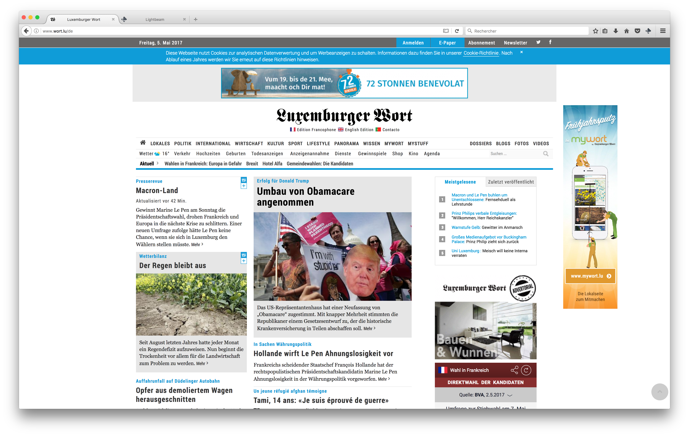
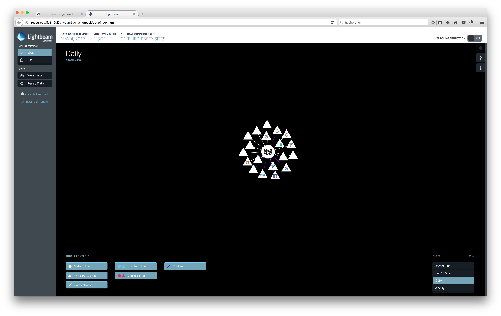

# New DNS workshop

## Name change proposal
DNS Workshop (as a name) is misleading. Content goes beyond DNS, and title should be more attractive and understanble by young target. Proposals listed hereafter. Feel free to add some.

- NavCode
- Virtual Online Codex
- Dynamic Internet Diary
- Secure Internet Map Making
- Tech behind the Net
- The dark side of the Net
- The other side of the Internet
- The secret side of the Internet
- Web = Internet + DNS + Kittens
- ...

## License:
The game concept, content, support documentation and all required documentation is licensed under a creative common CC 4.0 CC-BY-SA license

# Goal:
Create a 1 hour long game focused on explaining to 16 (max) children aged 8-12 years old divided in 3 groups the basic technical functionning of dynamic websites, DNS, and data filtering. Focus as much on fun than on technical content.

This WS is a collaborative creation between Savety and Securitymadein.lu. 
Co-Authors (non exhaustive list): 
- Loic Peden (savety)
- Matthieu Farcot (Securitymadein.lu)
- Emilie Muller (Securitymadein.lu)

Project co-financed BY EU, Connecting Europe Facility

# Requirements

# Content

The game is divided in 4 main steps.

## Step 1: Concept introduction, first technical elements, game concepts

- Global introduction, "The data Postman"
    - Introduce children to DNS concept as set up in the game (adapt content to age target)
    - Computers/Connected devices connected to the Internet each have a specific (IP) adress
    - These machines exchange "packets" on the Internet, in these packets, there is data (information)
    - IP adresses are composed of a set of numbers, just like a telephone number (numbers are easier to be treated by a computer, whereas humans prefer words)

     - [OBJJECTIVE 1] Vulgarize functionning of DNS.
     - [MEAN 1]Use real postal mail analogy. Relate to IP adresses. How can the computer find the right server?
     - [OBJECTIVE 2] Dynamic websites load from various servers in order to generate a single homogeneous content
     - [MEAN 2] Connect to a dynamic website and show audience a Lightbeam outcome : audience need to understand that a dynamic website is loadig from various places. Explain that connecting to Wort.lu (other example?) generates many other connections to various web servers and related data transfer. Use analogy with a tangible shop, only all shops in the street are aware in real time that you went in that shop and can monitor and listen to what you do and say (even geolocalize you in certain situations).
     

Process:
* Speaker starts introdfucing topic
* One child is designated as a DNS server
     
     
### Step 1 content example:

image source : LionKimbro, Wereldburger758, wikimedia.org

image source: m.farcot - securitymadein.lu

image source: m.farcot - securitymadein.lu

## Step 2:
- 
  - [OBJJECTIVE 1] Vulgarize functionning of DNS.
- [MEAN 1]Use real postal mail analogy. Relate to IP adresses. How can the computer find the right server?
- Children can create their own website
- Children have to pitch their website in a hackathon style
- Children have to vote for the best project
- The concept of filtering is introduced here

## Step 3:

- This stage is more competitive
- The goal is to reproduce the puzzle, children must collect the different pieces
- There are 2 servers: 1 server is slow but give reliable replies, the other server is faster but gives corrupted answers
- Children will not get expected outcomes if they choose rapidity
- The fastest server will be used by children but will lead to a saturation phenomenon
- Introduce black and white list

## Step 4:

- DDOS pass through DNS server
- Fake DNS queries sent
- Filtering is embodied by colour code
- Anti-virus filter

image source: m.farcot - securitymadein.lu
