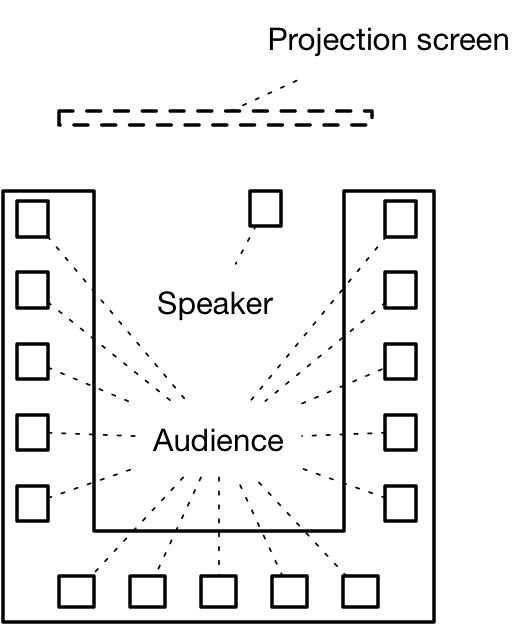

# Atelier Filtrage DNS

## Objectifs
Les objectifs de cet atelier sont de:
* faire comprendre aux enfants le concept d'interdépendance des ressources dans le rendu d'un site web
* faire comprendre aux enfants les bases du système de nommage
* faire comprendre aux enfants le concept de filtrage, notamment par blacklist
* sensibiliser les enfants aux problématiques de censure
* sensibiliser les enfants aux problématiques de choix technique des résolveurs DNS

## Déroulement
Cet atelier se déroule en 4 phases de jeu. Chaque phase de jeu vise un objectif pédagogique:
* la première phase vise à présenter le concept de jeu via le puzzle et faire appréhender le concept de résolution DNS via un jeu collaboratif
* la seconde phase vise à introduire le concept de filtrage et de création de site multi-dépendances via un jeu collaboratif
* la troisième phase vise à introduire le concept de détournement du système de nommage à des fins malveillantes via un jeu compétitif
* la quatrième phase vise à introduire le concept d'attaque par déni de service utilisant le système de nommage

Les enfants sont disposés de la manière suivante:

image source: m.farcot - securitymadein.lu

### Première phase
Lors de la première phase, les enfants ont pour objectif d'assembler un puzzle défini dont la globalité représente un site web (ex: wort.lu) et dont chacune des pièces représente une ressource tierce (par exemple les intégrations Facebook, Twitter, les trackers analytics ou encore la publicité). Une illustration avec le plugin Lightbeam est possible. 
Un groupe d'enfants dispose d'un cannevas représentant les pièces à assembler pour obtenir un site web complet. Trois autres groupes d'enfants représentent les intermédiaires techniques nécessaires pour obtenir ces pièces. Il s'agit pour deux groupes d'être les serveurs autoritaires et pour le dernier groupe d'être les serveurs servant les requêtes HTTP demandées par le groupe finalisant le puzzle.

### Seconde phase
Les enfants sont amenés à concevoir leur propre site web, en assemblant des briques de services tiers disponibles. Chaque groupe pitche son idée auprès de l'ensemble. Le pitch ayant collecté le plus de voix est sélectionné. Cependant, les animateurs peuvent modérer et décider d'interdire certains services, pour des raisons arbitraires. Par exemple, les enfants peuvent disposer initialement de briques relatives à la vente de sucreries mais voir ces briques interdites par les animateurs. Cette phase illustre le filtrage par une autorité tierce.

### Troisième phase
Les enfants sont répartis entre une blue team, dont le but est d'assembler le puzzle correspondant au site qu'ils ont conçu lors de l'étape 2. Et une red team dont le but est de corrompre la réalisation de ce puzzle. Le but de chaque groupe (au sein de la blue team) est d'obtenir un score le plus faible possible, correspondant à une résolution rapide du puzzle. A cette fin, la red team va jouer le rôle d'un nouveau résolveur DNS qui va donner des réponses corrompues. Afin d'être attractive, la red team dispose d'un avantage sur le résolveur DNS historique. Cet avantage se matérialise par une résolution supérieure (ie: à chaque tour, le résolveur red team va répondre deux fois plus de réponses que l'historique). 
L'animateur effectue un tour des enfants et chaque groupe peut alors demander n pièces (selon la capacité du résolveur). A chaque tour, un compteur est incrémenté. Lorsqu'un groupe complète son puzzle, il reçoit alors comme score temporaire le numéro du tour auquel il finit son puzzle. 
A la fin de cette phase, les enfants sont amenés à révéler à l'aide d'un filtre coloré les motifs apparaissant sur les pièces corrompues par la red team. Chaque motif complet révélé se révèle être une pénalité. Le montant de la pénalité est alors ajouté au score temporaire. L'animateur révèle alors l'existence de la red team et le fonctionnement des pénalités. Il propose alors de refaire une session, c'est la quatrième phase.

### Quatrième phase
Les enfants, toujours séparés en red teams et blue team sont amenés à reproduire la troisième phase. Il est probable que les joueurs choisiront alors d'utiliser le résolveur DNS historique plutôt que le résolveur de la red-team. Les joueurs de la red team pourront alors, pour chaque séquence, faire un nombre de requêtes au serveur DNS historique équivalent au nombre de pénalités du joueur effectuant sa requête. Ce nombre p de requêtes amènera l'animateur à passé le tour des p enfants suivant l'enfant ayant fait sa requête. Cela permet d'illustrer une congestion du serveur DNS permettant d'introduire le concept de déni de service par infection d'un botnet, et la pénalisation de la communauté.

## Matériel
Les enfants sont séparés en 3 groupes. Chaque groupe dispose de:
* 1 canevas physique (sous la forme d'un terminal comme un smartphone), par exemple réalisé en bois et disposant d'accroche de type Scratch

L'ensemble dispose de 3*s pièces représentant les s services  (où 3*s représente le nombre de pièces disponibles pour chacun des services disponibles: ex, si l'on dispose de 5 types de services, on dispose d'un jeu de 3*5=15 pièces)
* Ces pièces peuvent être imprimées en papier plasitifié (des modèles se trouvent sur le repo git)
* L'arrière de chaque pièce dispose d'un système d'accroche de type Scracth permettant une fixation sur le canevas

L'ensemble dispose de 3*s pièces représentant des services ayant les mêmes caractéristiques que précédement mais disposant de motifs à réveler. 
Les motifs peuvent être imprimés à l'aide de glyphes colorés et révélés par un filtre monochrome. Ils peuvent aussi être apposés à l'encre UV et révélés sous lumière noire.

L'animateur dispose d'un livret technique apportant les références techniques.

**version 0.5**
**contact: loic.peden@savety.lu**
